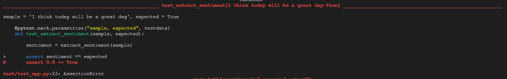
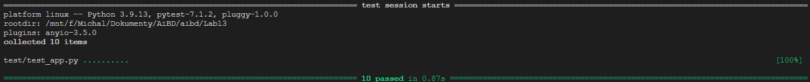
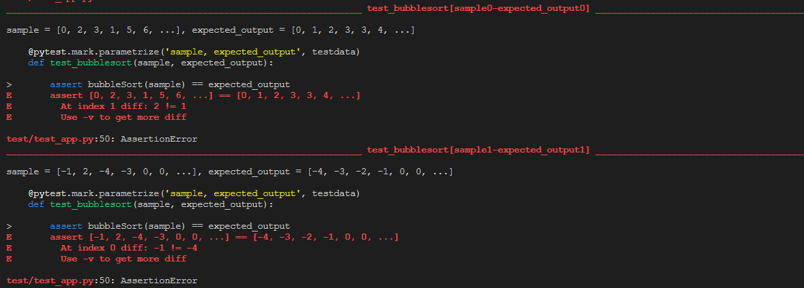

# Text contain word

* Faza red

* Faza green

* Faza refactoring

> Funkcja jest już wystarczająco prosta

# Bubble sort

* Faza red

* Faza green

* Faza refactoring

> Funkcja jest już wystarczająco prosta

>     n = len(arr)
>     for i in range(n):
>         for j in range(0, n-i-1):
>             if arr[j] > arr[j+1]:
>                 arr[j], arr[j+1] = arr[j+1], arr[j]
>     return arr
